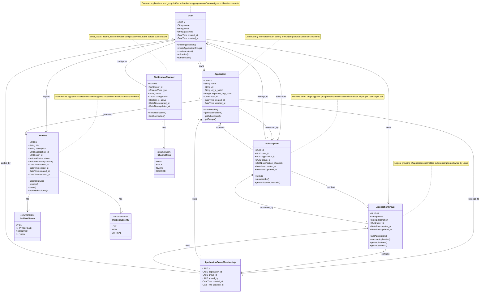

# Web Application Monitoring System - Project Overview

## 🎯 What is this project about?

This is a **Web Application Monitoring System** that helps teams and individuals monitor the health and availability of their web applications. Think of it as a "watchdog" for your websites and APIs that:

- **Continuously monitors** your web applications by checking if they're responding correctly
- **Automatically detects issues** when your apps are down or returning unexpected responses
- **Creates incidents** to track problems from detection to resolution
- **Notifies team members** who are subscribed to monitoring alerts
- **Provides a collaborative platform** for managing application reliability

### Key Value Proposition
Instead of discovering your website is down when customers complain, this system proactively monitors your applications 24/7 and immediately alerts your team when issues occur, enabling faster response times and better user experience.

---

## 🏗️ System Entities

### 1. **User**
Represents people who use the monitoring system.

**Properties:**
- `id` - Unique identifier
- `name` - Full name (e.g., "John Doe")
- `email` - Email address (unique, used for login)
- `password` - Encrypted password
- `created_at` - Account creation date
- `updated_at` - Last profile update date

**Role:** Can own applications, create incidents, subscribe to monitoring alerts

---

### 2. **Application**
Represents web applications being monitored.

**Properties:**
- `id` - Unique identifier (UUID)
- `name` - Application name (e.g., "Company Website")
- `url` - Main application URL (e.g., "https://mycompany.com")
- `url_to_watch` - Specific endpoint to monitor (optional, e.g., "/api/health")
- `expected_http_code` - Expected response code (default: 200)
- `user_id` - Owner of the application (foreign key)
- `created_at` - Registration date
- `updated_at` - Last modification date

**Role:** The target of monitoring activities, generates incidents when issues are detected

---

### 3. **Incident**
Represents issues or problems detected with applications.

**Properties:**
- `id` - Unique identifier (UUID)
- `title` - Brief description (e.g., "Website returning 500 errors")
- `description` - Detailed explanation of the issue
- `application_id` - Which application has the issue (foreign key)
- `user_id` - Who reported/created the incident (foreign key)
- `status` - Current state: OPEN → IN_PROGRESS → RESOLVED → CLOSED
- `severity` - Impact level: LOW, HIGH, CRITICAL
- `started_at` - When the issue began
- `ended_at` - When the issue was resolved (null while ongoing)
- `created_at` - When incident was reported
- `updated_at` - Last status/detail update

**Role:** Tracks problems from detection through resolution, maintains incident history

---

### 4. **Application Group**
Represents logical groupings of applications for organized monitoring.

**Properties:**
- `id` - Unique identifier (UUID)
- `name` - Group name (e.g., "Production APIs", "Frontend Applications")
- `description` - Group description (optional)
- `user_id` - Owner of the group (foreign key)
- `created_at` - Group creation date
- `updated_at` - Last modification date

**Role:** Organizes applications into logical groups, enables bulk subscription management

---

### 5. **Application Group Membership**
Represents the many-to-many relationship between applications and groups.

**Properties:**
- `id` - Unique identifier (UUID)
- `application_id` - The application (foreign key)
- `group_id` - The group (foreign key)
- `added_by` - User who added the application to group (foreign key)
- `created_at` - When application was added to group
- `updated_at` - Last modification date

**Role:** Links applications to groups, maintains group membership history

---

### 6. **Subscription**
Represents user interest in monitoring specific applications or application groups.

**Properties:**
- `id` - Unique identifier (UUID)
- `user_id` - The subscriber (foreign key)
- `application_id` - The application being monitored (foreign key, nullable)
- `group_id` - The application group being monitored (foreign key, nullable)
- `notification_channels` - JSON array of notification preferences (email, slack, teams, discord)
- `created_at` - Subscription date
- `updated_at` - Last modification date

**Business Rules:**
- Either `application_id` OR `group_id` must be set (not both)
- Group subscriptions automatically include all applications in the group
- When applications are added/removed from groups, notifications are sent to group subscribers

**Role:** Enables many-to-many relationships between users and applications/groups for notifications

---

### 7. **Notification Channel**
Represents configured notification channels for users.

**Properties:**
- `id` - Unique identifier (UUID)
- `user_id` - Channel owner (foreign key)
- `type` - Channel type: EMAIL, SLACK, TEAMS, DISCORD
- `name` - Channel name (e.g., "Dev Team Slack")
- `configuration` - JSON configuration (webhook URLs, channel IDs, tokens)
- `is_active` - Whether channel is enabled
- `created_at` - Channel creation date
- `updated_at` - Last modification date

**Role:** Manages user's notification delivery preferences and configurations

---

## 📖 User Stories

### 🏢 **Epic 1: Application Owner Stories**

#### Story 1: Register Application for Monitoring
**As an** application owner  
**I want to** register my web application in the monitoring system  
**So that** I can track its availability and get alerted when issues occur

**Acceptance Criteria:**
- I can provide app name and URL
- I can specify which endpoint to monitor
- I can set expected HTTP response code
- System starts monitoring immediately after registration

#### Story 2: Manage My Applications
**As an** application owner  
**I want to** view and update my registered applications  
**So that** I can keep monitoring configuration current

**Acceptance Criteria:**
- I can see list of all my applications
- I can edit application details (name, URL, expected response)
- I can delete applications I no longer need
- I can see monitoring status for each application

#### Story 3: Track Application Incidents
**As an** application owner  
**I want to** view and manage incidents for my applications  
**So that** I can track issues from detection to resolution

**Acceptance Criteria:**
- I can see all incidents for my applications
- I can update incident status (OPEN → IN_PROGRESS → RESOLVED → CLOSED)
- I can add details and comments to incidents
- I can see incident history and resolution times

### 👥 **Epic 2: Team Member Stories**

#### Story 4: Subscribe to Application Monitoring
**As a** team member  
**I want to** subscribe to individual applications or groups of applications  
**So that** I get notified when issues occur for any monitored resource

**Acceptance Criteria:**
- I can browse available applications and application groups
- I can subscribe to individual applications (even ones I don't own)
- I can subscribe to entire application groups for bulk monitoring
- I can see my current subscriptions (both apps and groups)
- I can unsubscribe from individual apps or entire groups when no longer interested
- When I subscribe to a group, I get notifications for all applications in that group

#### Story 5: Manage Application Groups
**As an** application owner or team lead  
**I want to** organize my applications into logical groups  
**So that** I can manage monitoring at scale and enable team subscriptions

**Acceptance Criteria:**
- I can create application groups with descriptive names
- I can add/remove applications to/from my groups
- I can see which applications belong to each group
- I can delete groups when no longer needed
- Team members can subscribe to my entire groups
- I can see who is subscribed to my groups

#### Story 6: Configure Notification Channels
**As a** team member  
**I want to** configure multiple notification channels (email, Slack, Teams, Discord)  
**So that** I receive incident alerts through my preferred communication methods

**Acceptance Criteria:**
- I can configure email notifications with custom addresses
- I can set up Slack webhook integrations for team channels
- I can configure Microsoft Teams webhook notifications
- I can set up Discord webhook notifications for community servers
- I can test my notification channels to ensure they work
- I can choose different channels for different subscriptions
- I can enable/disable channels without deleting configurations

#### Story 7: Receive Multi-Channel Incident Notifications
**As a** team member  
**I want to** receive notifications through my configured channels when incidents occur  
**So that** I can respond quickly through my preferred communication tools

**Acceptance Criteria:**
- I get notifications when new incidents are created for subscribed apps/groups
- I get updates when incident status changes
- I receive notifications through all my enabled channels (email, Slack, Teams, Discord)
- Notifications include incident details, severity, and direct links to the system
- I can see notification history across all channels
- Group subscriptions notify me about incidents in any application within the group

#### Story 8: Collaborate on Incident Resolution
**As a** team member  
**I want to** help resolve incidents for applications I monitor  
**So that** I can contribute to maintaining system reliability

**Acceptance Criteria:**
- I can view incident details for subscribed applications
- I can update incident status and add information
- I can see who else is working on incidents
- I can track resolution progress

### 🔧 **Epic 3: System Administrator Stories**

#### Story 7: Monitor System Health
**As a** system administrator  
**I want to** monitor the monitoring system itself  
**So that** I can ensure reliable service delivery

**Acceptance Criteria:**
- I can see system performance metrics
- I can monitor background job processing
- I can track API usage patterns
- I get alerts about system issues

### 🤖 **Epic 4: Automated System Stories**

#### Story 8: Automatic Health Monitoring
**As the** monitoring system  
**I want to** continuously check registered applications  
**So that** I can detect issues immediately

**Acceptance Criteria:**
- I check each application every 5 minutes
- I compare actual response with expected response
- I create incidents automatically when issues are detected
- I handle network timeouts and errors gracefully

#### Story 9: Incident Auto-Creation
**As the** monitoring system  
**I want to** automatically create incidents when I detect issues  
**So that** teams are immediately aware of problems

**Acceptance Criteria:**
- I create incidents with descriptive titles and details
- I set appropriate severity based on error type
- I notify all subscribers immediately
- I track when issues started

---

## 🔄 UML Class Diagram



---

## 🌐 API Endpoints Specification

### 🔐 **Authentication Endpoints**

```
POST   /api/auth/register           # User registration
POST   /api/auth/login              # User login (returns auth token)
POST   /api/auth/logout             # User logout (revoke token)
GET    /api/auth/user               # Get authenticated user profile
PUT    /api/auth/user               # Update user profile
POST   /api/auth/password/reset     # Request password reset
POST   /api/auth/password/confirm   # Confirm password reset with token
POST   /api/auth/email/verify       # Verify email address (optional)
```

### 📱 **Application Management Endpoints**

```
GET    /api/applications            # List user's applications (with nested incidents)
POST   /api/applications            # Create new application
GET    /api/applications/{id}       # Get specific application details
PUT    /api/applications/{id}       # Update application (owner only)
DELETE /api/applications/{id}       # Delete application (owner only)
GET    /api/applications/search     # Search applications by name/URL
PUT    /api/applications/{id}/group # Add/remove application from group
```

### 📱 **Application Group Management Endpoints**

```
GET    /api/application-groups      # List user's application groups
POST   /api/application-groups      # Create new application group
GET    /api/application-groups/{id} # Get specific group details with applications
PUT    /api/application-groups/{id} # Update group (name, description)
DELETE /api/application-groups/{id} # Delete group (owner only)
GET    /api/application-groups/search # Search groups by name/description
```

### 🔗 **Application Group Membership Endpoints**

```
POST   /api/application-groups/{id}/applications        # Add application to group
DELETE /api/application-groups/{id}/applications/{appId} # Remove application from group
GET    /api/application-groups/{id}/applications        # List applications in group
POST   /api/application-groups/{id}/applications/bulk   # Bulk add applications to group
DELETE /api/application-groups/{id}/applications/bulk   # Bulk remove applications from group
```

### 🔍 **Application Monitoring Endpoints**

```
POST   /api/applications/{id}/check          # Trigger manual health check
GET    /api/applications/{id}/status         # Get current monitoring status
GET    /api/applications/{id}/health-history # Get health check history
PUT    /api/applications/{id}/monitoring     # Update monitoring settings
```

### 🚨 **Incident Management Endpoints**

```
GET    /api/incidents               # List incidents (for user's apps + subscribed apps)
POST   /api/incidents               # Create new incident
GET    /api/incidents/{id}          # Get specific incident details
PUT    /api/incidents/{id}          # Update incident (status, details, etc.)
DELETE /api/incidents/{id}          # Delete incident (soft delete recommended)
GET    /api/incidents/search        # Search incidents by title/description/status
GET    /api/incidents/stats         # Get incident statistics
```

### 📊 **Incident Filtering & Reporting**

```
GET    /api/incidents?status=OPEN                    # Filter by status
GET    /api/incidents?severity=HIGH                  # Filter by severity
GET    /api/incidents?application_id={id}            # Filter by application
GET    /api/incidents?user_id={id}                   # Filter by reporter
GET    /api/incidents?start_date={date}              # Filter by date range
GET    /api/incidents?end_date={date}                # Filter by date range
GET    /api/applications/{id}/incidents              # Get all incidents for specific app
GET    /api/applications/{id}/incidents/active       # Get only active incidents
GET    /api/applications/{id}/incidents/resolved     # Get resolved incidents
```

### 📬 **Subscription Management Endpoints**

```
GET    /api/subscriptions                      # List user's subscriptions
POST   /api/subscriptions/applications/{id}    # Subscribe to application
POST   /api/subscriptions/groups/{id}          # Subscribe to application group  
DELETE /api/subscriptions/{id}                 # Delete subscription (unsubscribe)
GET    /api/subscriptions/search               # Search subscriptions
PUT    /api/subscriptions/{id}/channels        # Update notification channels for subscription
```

### 👥 **Application Subscriber Management**

```
GET    /api/applications/{id}/subscribers      # List app subscribers (owner only)
POST   /api/applications/{id}/subscribers      # Add subscriber (owner only) - optional
DELETE /api/applications/{id}/subscribers/{userId}  # Remove subscriber (owner only) - optional
```

### 👥 **Application Group Subscriber Management**

```
GET    /api/application-groups/{id}/subscribers      # List group subscribers (owner only)
POST   /api/application-groups/{id}/subscribers      # Add subscriber (owner only) - optional  
DELETE /api/application-groups/{id}/subscribers/{userId}  # Remove subscriber (owner only) - optional
```

### 🔔 **Notification Channel Management Endpoints**

```
GET    /api/notification-channels       # List user's notification channels
POST   /api/notification-channels       # Create new notification channel
GET    /api/notification-channels/{id}  # Get specific channel details
PUT    /api/notification-channels/{id}  # Update channel configuration
DELETE /api/notification-channels/{id}  # Delete notification channel
POST   /api/notification-channels/{id}/test  # Test channel connection
```

### 🔔 **Notification History Endpoints**

```
GET    /api/notifications           # Get user's notifications
PUT    /api/notifications/{id}/read # Mark notification as read
DELETE /api/notifications/{id}      # Delete notification
GET    /api/notifications/unread    # Get only unread notifications
PUT    /api/notifications/read-all  # Mark all notifications as read
GET    /api/notifications/history   # Get notification delivery history across all channels
```

### ⚙️ **User Preferences & Settings**

```
GET    /api/user/preferences        # Get notification preferences
PUT    /api/user/preferences        # Update notification preferences
GET    /api/user/settings           # Get user settings
PUT    /api/user/settings           # Update user settings
```

### 📈 **Statistics & Reporting Endpoints**

```
GET    /api/stats/dashboard         # Get dashboard statistics
GET    /api/stats/applications      # Get application statistics
GET    /api/stats/incidents         # Get incident statistics
GET    /api/stats/uptime/{id}       # Get uptime statistics for application
GET    /api/stats/response-times/{id}  # Get response time statistics
```

### 🔍 **Search & Discovery Endpoints**

```
GET    /api/search/applications     # Search public/discoverable applications
GET    /api/search/users           # Search users (for subscription purposes)
GET    /api/search/global          # Global search across entities
```

### 🛠️ **System Administration Endpoints** (Optional)

```
GET    /api/admin/system/status     # System health check
GET    /api/admin/users             # List all users (admin only)
GET    /api/admin/applications      # List all applications (admin only)
GET    /api/admin/incidents         # List all incidents (admin only)
GET    /api/admin/stats             # System-wide statistics
POST   /api/admin/maintenance       # Put system in maintenance mode
```

### 📊 **Webhook Endpoints** (Advanced Feature)

```
GET    /api/webhooks                # List user's webhooks
POST   /api/webhooks                # Create webhook
PUT    /api/webhooks/{id}           # Update webhook
DELETE /api/webhooks/{id}           # Delete webhook
POST   /api/webhooks/{id}/test      # Test webhook delivery
```

### 📤 **Export Endpoints**

```
GET    /api/export/incidents        # Export incidents to CSV/JSON
GET    /api/export/applications     # Export applications to CSV/JSON  
GET    /api/export/subscriptions    # Export subscriptions to CSV/JSON
GET    /api/export/reports/{type}   # Export various reports
```

### 🔄 **Batch Operations Endpoints**

```
POST   /api/batch/applications      # Batch create applications
PUT    /api/batch/applications      # Batch update applications
POST   /api/batch/incidents/status  # Batch update incident statuses
POST   /api/batch/subscriptions     # Batch create subscriptions
```

---

## 📋 API Response Formats

### Standard Success Response
```json
{
  "status": "success",
  "data": { /* response data */ },
  "meta": {
    "pagination": { /* if applicable */ },
    "timestamp": "2024-01-01T00:00:00Z"
  }
}
```

### Standard Error Response
```json
{
  "status": "error",
  "message": "Error description",
  "errors": { /* validation errors if applicable */ },
  "code": "ERROR_CODE",
  "timestamp": "2024-01-01T00:00:00Z"
}
```

### Paginated Response
```json
{
  "status": "success",
  "data": [ /* array of items */ ],
  "meta": {
    "pagination": {
      "current_page": 1,
      "per_page": 20,
      "total": 150,
      "total_pages": 8,
      "has_next": true,
      "has_previous": false
    },
    "timestamp": "2024-01-01T00:00:00Z"
  }
}
```

---

## 🔒 Authentication Requirements

All API endpoints (except auth/register and auth/login) require authentication via:
- **Bearer Token**: `Authorization: Bearer {token}` header
- **Session Cookie**: For web-based clients (optional)
- **API Key**: For service-to-service communication (optional)

---

## 📝 Common Query Parameters

### Filtering
- `?status=OPEN,IN_PROGRESS` - Filter by multiple values
- `?severity=HIGH` - Filter by severity
- `?user_id={id}` - Filter by user
- `?application_id={id}` - Filter by application

### Sorting
- `?sort=created_at` - Sort by field
- `?order=desc` - Sort order (asc/desc)

### Pagination
- `?page=2` - Page number
- `?per_page=50` - Items per page (max 100)

### Date Ranges
- `?start_date=2024-01-01` - Start date filter
- `?end_date=2024-01-31` - End date filter

### Including Related Data
- `?include=incidents` - Include nested incidents
- `?include=subscribers` - Include subscriber information
- `?include=user` - Include user details

---

## ✅ Functionality Checklist (Trello-style)

### 🔐 **Authentication & User Management**
- [ ] User registration with email/password
- [ ] User login with secure authentication
- [ ] Password reset functionality
- [ ] User profile management
- [ ] Email verification (optional)
- [ ] User logout and session management

### 📱 **Application Management**
- [ ] Register new application for monitoring
- [ ] Edit application details (name, URL, expected response)
- [ ] Delete application (with cascade cleanup)
- [ ] View all user's applications
- [ ] View application monitoring status
- [ ] Manual health check trigger
- [ ] Application list with search/filter

### 🔍 **Monitoring System**
- [ ] Automatic health checks every 5 minutes
- [ ] HTTP response code validation
- [ ] Network timeout handling
- [ ] Connection failure detection
- [ ] Custom endpoint monitoring (url_to_watch)
- [ ] Monitoring frequency configuration
- [ ] Health check history tracking
- [ ] Monitoring status dashboard

### 🚨 **Incident Management**
- [ ] Automatic incident creation from monitoring
- [ ] Manual incident creation
- [ ] Incident status workflow (OPEN → IN_PROGRESS → RESOLVED → CLOSED)
- [ ] Incident severity management (LOW, HIGH, CRITICAL)
- [ ] Incident details and description
- [ ] Incident assignment and tracking
- [ ] Incident history and timeline
- [ ] Incident search and filtering
- [ ] Incident resolution tracking
- [ ] Incident statistics and reporting

### 📱 **Application Groups Management**
- [ ] Create application groups with names and descriptions
- [ ] Add applications to groups
- [ ] Remove applications from groups
- [ ] View applications within groups
- [ ] Delete application groups
- [ ] Search and filter application groups
- [ ] Bulk add/remove applications to/from groups
- [ ] View group subscribers (for owners)

### 📬 **Subscription & Notifications**
- [ ] Subscribe to individual application monitoring
- [ ] Subscribe to application group monitoring (bulk subscription)
- [ ] Unsubscribe from individual applications
- [ ] Unsubscribe from application groups
- [ ] View current subscriptions (applications and groups)
- [ ] View application subscribers (for owners)
- [ ] View application group subscribers (for owners)
- [ ] Automatic notifications for group members when apps are added/removed

### 🔔 **Multi-Channel Notifications**
- [ ] Email notifications for incidents and status changes
- [ ] Slack webhook integration for team channels
- [ ] Microsoft Teams webhook integration
- [ ] Discord webhook integration for community servers
- [ ] Configure notification channels (email, Slack, Teams, Discord)
- [ ] Test notification channel connections
- [ ] Per-subscription notification channel preferences
- [ ] Enable/disable notification channels
- [ ] Notification delivery history across all channels
- [ ] In-app notification center
- [ ] Notification preferences management

### 🌐 **API Development**
- [ ] RESTful API design
- [ ] Authentication endpoints (register, login, logout)
- [ ] Application CRUD endpoints
- [ ] Application Group CRUD endpoints
- [ ] Application Group membership management endpoints
- [ ] Incident CRUD endpoints
- [ ] Subscription CRUD endpoints (applications and groups)
- [ ] Notification channel management endpoints
- [ ] Monitoring endpoints (status, manual check)
- [ ] Search and filtering endpoints
- [ ] Statistics and reporting endpoints
- [ ] Webhook endpoints for integrations
- [ ] Batch operations endpoints
- [ ] API documentation (Swagger/OpenAPI)
- [ ] API rate limiting
- [ ] API error handling
- [ ] API response pagination

### 🔒 **Security Features**
- [ ] Password hashing and encryption
- [ ] Secure token/session management
- [ ] Input validation and sanitization
- [ ] SQL injection prevention
- [ ] CSRF protection
- [ ] Rate limiting and abuse prevention
- [ ] Access control and authorization
- [ ] HTTPS/TLS encryption
- [ ] Security headers
- [ ] Audit logging

### ⚡ **Performance & Scalability**
- [ ] Database query optimization
- [ ] Background job processing for monitoring
- [ ] Caching for frequently accessed data
- [ ] Database indexing strategy
- [ ] API response time optimization
- [ ] Concurrent user support
- [ ] Load testing and performance monitoring
- [ ] Memory usage optimization

### 🧪 **Testing & Quality**
- [ ] Unit tests for business logic
- [ ] Integration tests for API endpoints
- [ ] End-to-end tests for critical workflows
- [ ] Database testing with fixtures
- [ ] Mock external dependencies
- [ ] Performance testing
- [ ] Security testing
- [ ] Test coverage reporting (90%+ target)

### 📊 **Monitoring & Operations**
- [ ] Application logging and monitoring
- [ ] Error tracking and alerting
- [ ] Performance metrics collection
- [ ] Database backup and recovery
- [ ] Health check for the monitoring system itself
- [ ] System administration dashboard
- [ ] Usage analytics and reporting
- [ ] Capacity planning metrics

### 🎨 **User Experience**
- [ ] Responsive web interface (optional)
- [ ] User-friendly error messages
- [ ] Loading states and progress indicators
- [ ] Data visualization (charts, graphs)
- [ ] Export functionality (CSV, PDF)
- [ ] Keyboard shortcuts and accessibility
- [ ] Multi-language support (optional)
- [ ] Dark/light theme support (optional)

### 🚀 **DevOps & Deployment**
- [ ] Docker containerization
- [ ] Database migrations
- [ ] Environment configuration
- [ ] Kubernetes deployment
- [ ] AWS/Azure/GCP deployment
- [ ] CI/CD pipeline setup
- [ ] Production deployment scripts
- [ ] Backup and restore procedures
- [ ] Monitoring and alerting setup
- [ ] Documentation and README

---

## 🎯 Core Features Summary

This monitoring system provides **4 core capabilities**:

1. **Proactive Monitoring**: Continuously watches your applications and detects issues automatically
2. **Incident Tracking**: Manages problems from detection through resolution with a clear workflow
3. **Team Collaboration**: Enables teams to subscribe to applications and stay informed about issues
4. **Historical Visibility**: Maintains records of application reliability and incident patterns

The system is designed to be **technology-agnostic** and can be implemented using any modern web framework (Laravel, Django, Express.js, Spring Boot, etc.) while maintaining the same core functionality and user experience.
